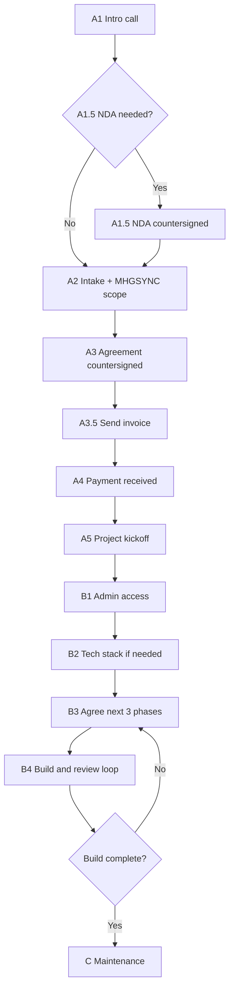

# Web Services Lifecycle

**Optimized SOP v2 — June 2026 | Mikel Hunt Group Inc. DBA MHG Strategy**

Standard operating procedure for Web Services engagements — from the initial intro call through build completion and ongoing maintenance.

**Published:** [mhgstrategy.com/webops/lifecycle](https://mhgstrategy.com/webops/lifecycle/) · [mhgsync.com/sales/lifecycle](https://mhgsync.com/sales/lifecycle/) (team login required)

---

## What changed in v2

Two legal documents are now formally embedded in the Phase A sales flow: an optional NDA (between the intro call and intake meeting) and a signed engagement agreement (between scoping and payment). Reference agreements from Roller Land and Pyramid Logistics are on file and should be used for tone, structure, and clause language when drafting new deals. The entity name on all documents going forward is **Mikel Hunt Group Inc. DBA MHG Strategy**.

| What changed | Detail |
|---|---|
| **Entity name** | MHG Media Group is retired. All agreements use: Mikel Hunt Group Inc. DBA MHG Strategy |
| **New step: A1.5 — NDA (optional)** | Introduced between A1 (intro call) and A2 (intake). Triggered when client shares sensitive data or credentials before a signed agreement exists |
| **New step: A3 — Agreement signing** | Introduced before invoicing. No invoice sent until agreement is countersigned |
| **Agreement templates on file** | Roller Land (Digital Services Agreement) and Pyramid Logistics (Engagement Agreement + NDA) serve as style references for future drafts |
| **MHGSYNC scope automation** | Retained from v1. Scope draft auto-generated from intake form; replaces manual scoping meeting |
| **Invoicing (A3.5)** | Still the #1 bottleneck. Flagged as priority open item |

---

## Lifecycle overview

Three phases. **Phase A (Sales)** ends when payment clears. **Phase B (Delivery)** loops through planning, building, and review until scope is complete. **Phase C (Maintenance)** is ongoing.

**Updated Phase A sequence:**

1. **A1** — Intro call (~5 min)
2. **A1.5** — NDA (optional — triggered by deal sensitivity)
3. **A2** — Intake meeting + MHGSYNC scope generation
4. **A3** — Agreement drafted and countersigned
5. **A3.5** — Send invoice
6. **A4** — Payment received ← hard gate
7. **A5** — Project kickoff

---

## Phase A — Sales (pre-project)

All steps below happen before any build work begins. **Do not begin Phase B until payment is confirmed.**

### A1 — Initial 5-minute phone call

| | |
|---|---|
| **Purpose** | Qualify fit, schedule the intake meeting, and capture preliminary technical context |
| **Owner** | Sales / account lead |
| **Duration** | ~5 minutes |
| **Exit criteria** | Intake meeting scheduled; preliminary tech stack noted; NDA need assessed |

**During the call:**

- Confirm the prospect is a fit for Web Services (vs. RevOps or a referral elsewhere).
- Schedule the intake meeting.
- Assess whether an NDA is warranted before the intake meeting:
  - Client will share credentials, financial data, or proprietary systems data
  - Deal involves a third-party data environment (e.g., Salesforce, ERP, accounting systems)
  - Client requests confidentiality before disclosing business details

**Capture in CRM:**

- Company name and primary contact
- Current hosting / registrar / CMS
- Reason for reaching out
- Intake meeting date and time
- NDA needed: Yes / No / TBD

---

### A1.5 — NDA (optional)

> **Optional step:** Send only when the client will share sensitive data before a signed engagement agreement is in place. Skip for straightforward web projects where no credentials or proprietary data are exchanged pre-agreement.

| | |
|---|---|
| **Purpose** | Protect both parties' confidential information during the pre-engagement discovery phase |
| **Owner** | Account lead |
| **Triggered by** | Client shares credentials, financial records, or proprietary systems data before a signed agreement |
| **Template ref** | Pyramid Logistics NDA (October 2025) — on file |
| **Exit criteria** | NDA countersigned by both parties before intake meeting proceeds |

**Drafting guidance (reference: Pyramid NDA):**

- Entity name on all NDAs: **Mikel Hunt Group Inc. DBA MHG Strategy**, 712 Congress Avenue, New Haven, CT 06519
- Governing law: use Connecticut unless the client's jurisdiction requires otherwise (Pyramid NDA used California at client's request — that was an exception)
- Standard term: 2-year agreement term; confidentiality obligations survive for 3 years post-termination
- Confidential Information definition should explicitly cover: system credentials, financial records, business data, reports, trade secrets, client information, and any materials exported from client systems
- Recipient obligations to include: purpose limitation, need-to-know restriction, secure access methods, no unauthorized copying or export, prompt breach notification
- Exclusions (standard): publicly known info, lawfully received from a third party, independently developed, or required by law/court order
- Remedies clause: Disclosing Party may seek equitable relief including injunctions, in addition to remedies at law

---

### A2 — Intake meeting + MHGSYNC scope generation

> **Optimized:** Scope is auto-generated by MHGSYNC from intake responses. The separate "Determine scope" meeting is eliminated for most engagements.

| | |
|---|---|
| **Purpose** | Walk the client through discovery; MHGSYNC generates scope draft from responses |
| **Owner** | Account lead |
| **Duration** | Typically 30–60 minutes |
| **Intake hub** | [mhgstrategy.com/webops/intake](https://mhgstrategy.com/webops/intake/) |
| **Exit criteria** | Client completes intake form; MHGSYNC scope draft reviewed and confirmed internally |

**Intake verticals** — guide the client to the form that best matches their business. Default to **General Business** if no vertical fits.

| Vertical | Intake form path |
|----------|------------------|
| Ministry | `/webops/intake/ministry/` |
| Ecommerce / Online Retail | `/webops/intake/ecommerce/` |
| Real Estate & Property | `/webops/intake/real-estate/` |
| Logistics | `/webops/intake/logistics/` |
| Storefront Entertainment | `/webops/intake/storefront-entertainment/` |
| Junk Removal | `/webops/intake/junk-removal/` |
| Warehousing | `/webops/intake/warehousing/` |
| Insurance | `/webops/intake/insurance/` |
| Restaurant | `/webops/intake/restaurant/` |
| Catering | `/webops/intake/catering/` |
| Consulting & Coaching | `/webops/intake/consulting/` |
| Beauty & Wellness | `/webops/intake/beauty-wellness/` |
| Accounting & Bookkeeping | `/webops/intake/accounting/` |
| Home Services | `/webops/intake/home-services/` |
| General Business (default) | `/webops/intake/general-business/` |

**After form submission:**

1. MHGSYNC auto-generates a scope draft and surfaces it in the discovery dashboard.
2. Account lead reviews the draft with the delivery lead before presenting to client.
3. Confirm scope covers: deliverables, timeline, client dependencies, out-of-scope items, and any required tech stack changes.
4. Minor adjustments are normal — the draft is a starting point, not a final document.

---

### A3 — Agreement drafted and countersigned

> **New step:** The engagement agreement is drafted and signed **before** the invoice goes out. No invoice is sent and no work begins until the agreement is fully executed by both parties.

| | |
|---|---|
| **Purpose** | Formally bind both parties to scope, timeline, payment, and IP terms before any work begins |
| **Owner** | Account lead (draft) → both parties (signature) |
| **Template refs** | Roller Land Digital Services Agreement; Pyramid Logistics Engagement Agreement — both on file |
| **Entity name** | Mikel Hunt Group Inc. DBA MHG Strategy, 712 Congress Avenue, New Haven, CT 06519 |
| **Exit criteria** | Agreement countersigned by both parties; copy filed internally |

**Standard agreement structure (reference: Roller Land + Pyramid docs):**

1. **Project Specifications** — List all deliverables, phases, and completion targets explicitly. Use a phase/deliverable/timeline table for multi-phase projects (see Pyramid format).
2. **Revisions** — State allowed revision rounds (typically 2). Overages apply toward monthly resource hours.
3. **Price and Payment** — State total fee, billing structure (100% upfront or milestone-based), and accepted payment methods (ACH, check payable to Mikel Hunt Group Inc.).
4. **Duties of the Client** — List all materials and credentials the client must provide, with deadlines tied to project phases.
5. **Definitions** — Define Deliverables, Services, Business Day, Fees, Intellectual Property, Revisions, Confidential Information.
6. **Confidentiality** — Mutual; survives termination.
7. **Intellectual Property** — Deliverables transfer to Client upon full payment. MHG Strategy retains portfolio/case-study rights only.
8. **Acceptance of Deliverables** — Deemed accepted if no written objection within 10 business days of delivery.
9. **Governing Law** — Connecticut (default). Adjust only at client's documented request.
10. **Alternative Dispute Resolution** — Mediation first.
11. **Amendments** — Must be written and signed by both parties.
12. **Representations & Warranties** — Both parties confirm authority to enter the agreement.
13. **Disclaimer of Warranties** — Consultant warrants delivery of services, not specific business outcomes (sales, exposure, profits).
14. **Limitation of Liability** — Cap at total fees paid; no indirect, consequential, or punitive damages.
15. **Severability**
16. **Entire Agreement**
17. **Termination** — Include term length, breach cure period (15 days), IP ownership upon termination, and no-refund clause once work has commenced.
18. **Force Majeure**
19. **Signature Page** — MHG Strategy (Shaun Daniels, CEO or President) + Client signatory.

**Tone and style notes:**

- Mirror the clean, plain-language style of the Roller Land and Pyramid agreements — professional but readable, no legalese for its own sake.
- Use bold underline headers for each numbered section (consistent with both reference docs).
- Keep definitions in a dedicated section (Section 5) rather than inline — makes the doc easier to reference.
- For larger engagements (e.g., Pyramid at $16K), use a milestone table in Section 2. For small/flat-fee projects (e.g., Roller Land at $200), prose phases are fine.

---

### A3.5 — Send invoice

> **Policy location:** Invoicing policy is canonical in [Finance SOP §5](../sops/08_SOP_FINANCE.md). Exec sign-off pending on PROPOSED dunning and small-project items.

| | |
|---|---|
| **Purpose** | Issue invoice once agreement is countersigned; triggers the payment step |
| **Owner** | Account lead / finance |
| **Exit criteria** | Invoice sent to client |

> **Canonical policy:** Invoicing runs through **Stripe** (hosted invoices, ACH + card, automated reminders) with payouts reconciled in **Novo**. See [`docs/sops/08_SOP_FINANCE.md`](../sops/08_SOP_FINANCE.md) §5.1–5.4 for quote-to-cash flow, 40/30/30 project schedule, and proposed dunning cadence. Exec sign-off still pending on PROPOSED items (dunning, small-project trigger, milestone threshold).

---

### A4 — Payment received

| | |
|---|---|
| **Purpose** | Confirm funds before starting delivery |
| **Owner** | Finance / account lead |
| **Exit criteria** | Payment confirmed; project marked active |

**Do not begin build work until payment is received.** This is a hard gate. Both the agreement (A3) and invoice (A3.5) must have been executed before this step can clear.

---

### A5 — Project kickoff

| | |
|---|---|
| **Purpose** | Transition from sales to delivery |
| **Owner** | Delivery lead |
| **Exit criteria** | Client notified; delivery phase begins |

- Confirm scope with the client.
- Set communication expectations and cadence.
- Move into Phase B.

---

## Phase B — Delivery (build)

Work performed after payment is received. Phase B loops through planning, building, and review until all scoped work is accepted.

### B1 — Attain admin access

| | |
|---|---|
| **Purpose** | Secure access to client accounts without password sharing where possible |
| **Owner** | Delivery lead |
| **Exit criteria** | Admin or equivalent access confirmed for all accounts in scope |

**Accounts to secure as needed:**

- Domain registrar (GoDaddy, Namecheap, etc.)
- Hosting (Bluehost, etc.)
- CMS / site builder (WordPress, Shopify, etc.)
- DNS, SSL, email
- Analytics, search console, ad accounts
- For data/analytics projects: Salesforce, ERP, accounting systems (via secure credentials per NDA terms)

> **Bluehost:** Live at [mhgstrategy.com/webops/bluehost](https://mhgstrategy.com/webops/bluehost/) — Shaun receives an email invitation to accept admin access.  
> **GoDaddy:** Planned — will mirror the Bluehost guide pattern; blocked on screenshot capture from registrar walkthrough.

---

### B2 — Improve tech stack (if necessary)

| | |
|---|---|
| **Purpose** | Upgrade or migrate infrastructure only as needed to fulfill scope |
| **Owner** | Delivery lead |
| **Exit criteria** | Stack supports planned build work |

- Migrate to appropriate hosting tier
- Configure DNS, SSL, CDN
- Update CMS, themes, or plugins
- Set up staging environment

**Do not over-engineer.** Change only what the scope requires.

---

### B3 — Agree on the next 3 phases

| | |
|---|---|
| **Purpose** | Break the build into manageable chunks with clear deliverables |
| **Owner** | Delivery lead + client |
| **Exit criteria** | Next 3 phases documented and agreed with client |

Plan **3 phases at a time** so the client always knows what is coming next without committing the entire project upfront.

> **TBD:** Define what constitutes a "phase" consistently (feature bundle vs. page count vs. time-boxed sprint).

---

### B4 — Build and review loop

Repeat until all scoped work is done:

1. **Build** — Complete the current phase(s).
2. **Review** — Client reviews completed work and provides written feedback.
3. **Acceptance** — If no written objection within 10 business days of delivery, deliverable is deemed accepted (per agreement Section 8).
4. **Agree on next 3 phases** — Plan the following chunk of work.
5. **Repeat** — Continue until all scoped work is done.

---

### B5 — Completion and launch

| | |
|---|---|
| **Purpose** | Close out the build engagement |
| **Owner** | Delivery lead |
| **Exit criteria** | Site live; client sign-off; handoff to maintenance if applicable |

- Final review and client approval
- DNS cutover, SSL validation, redirect checks
- Analytics and search console verification
- Handoff documentation
- Transition to Phase C if maintenance is part of the engagement

---

## Phase C — Maintenance

| | |
|---|---|
| **Purpose** | Keep the site or system secure, updated, and supported |
| **Owner** | Delivery / support lead |
| **Exit criteria** | Ongoing — retainer or ad-hoc arrangement in place |

Maintenance expectations are captured during intake (monthly retainer vs. client self-manages). Align the ongoing arrangement with what was discussed in discovery.

> **TBD:** Maintenance scope, SLA, billing cadence, and escalation path.

---

## Agreement reference files on file

| Document | Reference use |
|----------|----------------|
| Roller Land Digital Services Agreement (Sep 2025) | Template for web/design projects. Simple flat-fee structure, prose phase format, 2-revision policy. Use for small to mid-size web engagements. |
| Pyramid Logistics Engagement Agreement (Nov 2025) | Template for data/analytics/RevOps projects. Milestone table format, maintenance fee structure, AI token usage clause. Use for complex multi-system integrations. |
| Pyramid Logistics NDA (Oct 2025) | Template for pre-engagement NDAs. California governing law was client-specific; default to Connecticut. 2-year term, 3-year survival on confidentiality obligations. |

---

## Related tools and runbooks

| Resource | Link / path |
|----------|-------------|
| Intake hub | [mhgstrategy.com/webops/intake](https://mhgstrategy.com/webops/intake/) |
| Bluehost admin guide | [mhgstrategy.com/webops/bluehost](https://mhgstrategy.com/webops/bluehost/) |
| MHGSYNC discovery dashboard | [mhgsync.com](https://mhgsync.com/) (post-intake, auto-generated scope) |
| Lifecycle SOP (public) | [mhgstrategy.com/webops/lifecycle](https://mhgstrategy.com/webops/lifecycle/) |
| Lifecycle SOP (team) | [mhgsync.com/sales/lifecycle](https://mhgsync.com/sales/lifecycle/) |
| Intake form configs | [`lib/intake/intakeForms.ts`](../../lib/intake/intakeForms.ts) |
| Leads pipeline | [`APPS_SCRIPT_LEADS_ENDPOINT.md`](../../APPS_SCRIPT_LEADS_ENDPOINT.md) |
| Form system | [`lib/forms/README.md`](../../lib/forms/README.md) |
| Documentation index | [`docs/README.md`](../README.md) |

---

## Open items

Priority order:

1. [x] **Invoicing tool, template, deposit amount, and payment terms (A3.5)** — Canonical policy in [Finance SOP §5](../sops/08_SOP_FINANCE.md); exec sign-off pending on PROPOSED dunning/small-project items
2. [ ] GoDaddy and other host admin access guides (B1)
3. [ ] Standard definition of a build "phase" (B3)
4. [ ] MHGSYNC discovery dashboard workflow documentation
5. [ ] Maintenance retainer scope, SLA, and billing (C)
