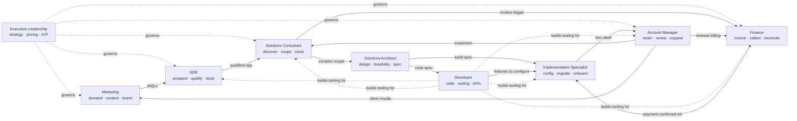

# MHG Strategy — Operating SOP Index

**Mikel Hunt Group Inc. DBA MHG Strategy** · Version 1.3 · Effective June 2026

This index is the spine of the MHG operating system. It maps the nine functional SOPs to the value chain, defines how each function hands off to the next, and consolidates the cross-team interface matrix so the documents interlock rather than describe silos.

> **Read this first.** Every SOP describes a **function**, not a named person. At current headcount (2 principals), all nine functions are shared across the two of us; the "Current owner" field on each doc reflects accountability, not a dedicated hire. As we hire, each function narrows from "shared" to a role, then to an individual, with no rewrite required.

---

## 1. Document control

| Field | Value |
|-------|-------|
| Document owner | Executive Leadership |
| Current owner | Both principals (shared) |
| Approver | Executive Leadership |
| Version | 1.0 |
| Effective | June 2026 |
| Review cadence | Quarterly |

---

## 2. The nine functions

| # | Function | One-line mandate | SOP |
|---|----------|------------------|-----|
| 01 | **Executive Leadership** | Strategy, pricing, positioning, partnerships, capital, final escalation | [01_SOP_EXECUTIVE_LEADERSHIP.md](01_SOP_EXECUTIVE_LEADERSHIP.md) |
| 02 | **Marketing** | Demand generation, content, brand, channel partnership, conversion | [02_SOP_MARKETING.md](02_SOP_MARKETING.md) |
| 03 | **SDR** | Outbound prospecting, inbound qualification, routing, booking | [03_SOP_SDR.md](03_SOP_SDR.md) |
| 04 | **Solutions Consultant** | Discovery, scope, agreement, close, invoice trigger | [04_SOP_SOLUTIONS_CONSULTANT.md](04_SOP_SOLUTIONS_CONSULTANT.md) |
| 05 | **Solutions Architect** | Technical design authority, build spec, feasibility, effort | [05_SOP_SOLUTIONS_ARCHITECT.md](05_SOP_SOLUTIONS_ARCHITECT.md) |
| 06 | **Implementation Specialist** | Config-driven delivery, migration, onboarding | [06_SOP_IMPLEMENTATION_SPECIALIST.md](06_SOP_IMPLEMENTATION_SPECIALIST.md) |
| 07 | **Developer** | Custom code: sites, MHGSYNC backoffice, APIs, internal tooling | [07_SOP_DEVELOPER.md](07_SOP_DEVELOPER.md) |
| 08 | **Finance** | Invoicing, collection, deposits, dunning, reconciliation, payouts | [08_SOP_FINANCE.md](08_SOP_FINANCE.md) |
| 09 | **Account Manager** | Retention, health, renewals, expansion, recurring billing trigger | [09_SOP_ACCOUNT_MANAGER.md](09_SOP_ACCOUNT_MANAGER.md) |

**The former Sales SOP has been retired.** Its top-of-funnel lead-capture detail (lead-source matrix, intake routing, offers funnel, Cal.com URLs, CRM schema) is folded into **SDR (03 §5.4–5.7)**, and its A1–A5 lifecycle ownership map + NDA rules into **Solutions Consultant (04 §5)**. No standalone Sales SOP remains; SDR + SC are the canonical sales documents.

---

## 3. Value chain — how a dollar moves through the company

**Plain-language flow:** Marketing creates demand → SDR qualifies and books → Solutions Consultant closes and triggers the invoice → Finance's payment confirmation (the A4 hard gate) green-lights build → Solutions Architect specs it → Implementation Specialist and Developer build it → Implementation Specialist hands the live client to the Account Manager → Account Manager retains, expands (back to Solutions Consultant), feeds results to Marketing, and triggers recurring billing through Finance. Executive Leadership governs the whole chain; Developer builds the internal systems every other function runs on.

---

## 4. Master cross-team interface matrix

Each cell reads **"Row function delivers X to Column function."** Blank = no direct standing interface. This is the single source of truth for handoffs; every SOP's Section 6 must agree with this matrix.

| Delivers ↓ / To → | Exec | Mktg | SDR | SC | SA | IS | Dev | Fin | AM |
|---|---|---|---|---|---|---|---|---|---|
| **Exec** | — | ICP, budget, positioning approval | ICP, quota | pricing authority, discount approval | roadmap priority | — | tooling roadmap priority | controls approval, capital | expansion strategy, churn escalation |
| **Marketing** | campaign performance, positioning proposals | — | MQLs, campaign context, content | collateral, conversion pages | — | — | site/content change requests | channel commission spend | — |
| **SDR** | pipeline top-of-funnel | lead-quality feedback, objections | — | qualified, booked opportunity | — | — | CRM bug/feature requests | — | — |
| **SC** | forecast, win/loss | win/loss themes | disposition feedback | — | validated business scope | client context | — | invoice trigger (agreement signed) | warm client handoff |
| **SA** | technical risk, effort | — | — | feasibility, effort, scope boundaries | — | build spec / runbook | code spec | cost-of-delivery inputs | — |
| **IS** | delivery status | — | — | delivery confirmation | as-built feedback | — | config-blocked escalations | — | live, configured client + docs |
| **Dev** | roadmap status, risk | shipped site/conversion features | CRM/PM features | — | platform constraints | features to configure | — | billing-system features | PM/health features |
| **Finance** | financials, AR aging, cash | budget actuals | — | payment status | — | payment confirmed (A4 gate) | billing requirements | — | recurring invoice status |
| **AM** | account health, churn signals | client results / case studies | referrals | expansion opportunities | change-request impact | support/change escalations | feature requests from clients | renewal & expansion billing triggers | — |

---

## 4a. Canonical rate card

All pricing is canonical in **Finance §5.2**. Summary — **WebOps ladder:** GTM **$600+** · Growth **$2,500+** · Automation **$5,000+** ($5k onboarding) · Managed WebOps **$10,000–15,000** ($10k onboarding, by qualification); domain/hosting pass-through; 50% off for non-profits/churches/community activists. **RevOps ladder** (floor → target, + tool-fee pass-through): Consult **$2,500→$3,000/mo** (or $250/hr virtual · $500/hr in-person + travel rider) · RevOps **$5,000→$6,000/mo** ($5k onboarding) · Automation **$7,500→$10–12k/mo** ($10k onboarding) · Managed RevOps **$15,000→$18–25k/mo**. Project builds >$1,500: **40% non-refundable / 30% at 50% / 30% at 85%**.

---

## 5. Shared systems (who owns what)

| System | URL / location | Owning function | Primary users |
|--------|----------------|-----------------|---------------|
| Public site | mhgstrategy.com | Developer (build) / Marketing (content) | All |
| MHGSYNC backoffice | mhgsync.com | Developer | SC, SA, IS, AM |
| CRM | Google Sheets → TwentyCRM (in progress — Sheets operational until cutover) | Developer (build) / SDR + SC (data) | SDR, SC, AM |
| Project management | MHGSYNC PM module (in build) | Developer | SA, IS, AM |
| Leads endpoint | Apps Script web app | Developer | SDR |
| Scheduling | Cal.com | SDR / SC | SDR, SC, AM |
| Banking | Novo | Finance | Finance, Exec |
| Payments / invoicing | Stripe | Finance | Finance |
| Intake API | MHGSYNC `/api/intake` | Developer | SC, SA |

---

## 6. Escalation ladder (global)

| Level | Owner | Triggers |
|-------|-------|----------|
| L1 | Function owner | Routine exceptions inside one function |
| L2 | Adjacent function owner | Cross-function handoff dispute or delay |
| L3 | Executive Leadership | Pricing/scope/legal exceptions, AR > 30 days, churn risk, partner disputes |

---

## 7. Revision history

| Version | Date | Changes |
|---------|------|---------|
| 1.0 | June 2026 | Initial nine-function operating system + interface matrix |
| 1.1 | June 2026 | Added canonical rate-card summary |
| 1.2 | June 2026 | Updated summary to locked WebOps + RevOps tier ladders |
| 1.3 | June 2026 | Retired Sales SOP reference; pointed sales canon to SDR + SC |
