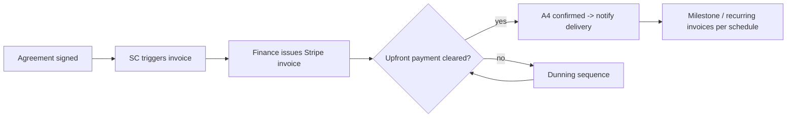

# Finance SOP

**Mikel Hunt Group Inc. DBA MHG Strategy** · Version 1.2 · Effective June 2026

> Describes the **finance function**, not a person. Currently shared by both principals.
>
> **Status note:** Pricing and the project payment schedule are now **confirmed policy** (Executive-set). Dunning cadence and the small-project payment trigger remain **[PROPOSED]** pending sign-off. Built on **Novo (banking) + Stripe (invoicing & collection)**.
>
> *This is operational guidance, not legal, tax, or financial advice. Terms and tax treatment should be confirmed with licensed counsel/CPA.*

---

## 1. Document control

| Field | Value |
|-------|-------|
| Function owner | Finance |
| Current owner | Both principals (shared) |
| Approver | Executive Leadership |
| Version | 1.2 |
| Effective | June 2026 |
| Review cadence | Monthly until fully standardized, then quarterly |

---

## 2. Purpose & scope

Finance turns signed agreements into collected cash and keeps the books clean. It owns the **A4 hard gate** — no delivery begins until payment is confirmed — making this function the literal gate between sold work and started work.

### Owns
- Invoice issuance (Stripe), payment collection, and reconciliation (Novo)
- The **rate card**, deposit/payment schedule, and tool-fee / hosting pass-through billing
- Dunning cadence and accounts receivable
- The A4 payment-confirmation gate and the green light to delivery
- Recurring/retainer billing for RevOps and Managed Ops (with Account Manager triggers)
- Channel-partner commission payouts (Boston partner)
- Bookkeeping and cash-position reporting to Exec

### Does not own
- Invoice *trigger* (SC triggers on signature); pricing *authority* (Exec sets the rate card); agreement terms (SC/Exec); banking strategy/capital (Exec).

---

## 3. Roles & responsibilities (RACI)

| Activity | Fin | SC | AM | Exec |
|----------|-----|----|----|------|
| Issue invoice | **R/A** | C (trigger) | I | I |
| Collect / reconcile | **R/A** | I | I | I |
| Rate card / discount policy | **R** | C | C | **A** |
| Payment schedule | **R/A** | C | I | A |
| Dunning | **R/A** | C | C | C (L3) |
| A4 payment confirmation | **R/A** | I | I | I |
| Recurring + tool-fee billing | **R** | I | **C (trigger)** | I |
| Commission payouts | **R** | I | I | **A (terms)** |

---

## 4. Systems & tools

| System | Use |
|--------|-----|
| **Novo** | Operating/banking account; Stripe payouts land here; reconciliation |
| **Stripe** | Hosted invoices (ACH + card), payment links, automated reminders, recurring subscriptions |
| MHGSYNC / CRM | Agreement + payment status tracking |
| Agreement templates | Terms reference (Roller Land / Pyramid) |
| Bookkeeping | Categorization, monthly close (tool TBD) |

---

## 5. Core workflows

### 5.1 Quote-to-cash (A3.5 → A4)

1. SC triggers the invoice on countersignature (no invoice before full execution).
2. Finance issues the Stripe invoice for the upfront amount (deposit or first month).
3. On clearance, Finance marks **A4 confirmed** and notifies delivery (IS/SA) — the green light.
4. Subsequent invoices issue per the payment schedule below; final project payment releases IP per the agreement.

### 5.2 Rate card (canonical — all other SOPs reference this)

Prices are **floors ("starts at")**; **target** is what we quote a fit-profile client (growth-stage, 50–500 employees). Quote at target, hold the floor as the walk-away.

**WebOps tiers**

| Tier | Monthly | Onboarding | Scope summary |
|------|---------|------------|---------------|
| **WebOps GTM** | **$600+** | — | Simple build + regular updates; consulting |
| **WebOps Growth** | **$2,500+** | — | Roadmap, analytics, CRO, SEO governance, CMS admin, monthly strategy + reporting |
| **WebOps Automation** | **$5,000+** | **$5,000** | Everything in Growth + CRM integration, form-to-CRM, lead routing, marketing/reporting automation, 1–2 workflow builds/mo (the WebOps↔RevOps bridge) |
| **Managed WebOps** | **$10,000–15,000** | **$10,000** | Full website ownership, CRO + SEO programs, dev/hosting/analytics mgmt, AI content workflows, unlimited backlog within SLA — **by qualification** |

- **Domain & hosting:** *management* is in-scope at Growth and above; the **actual domain/hosting cost is passed through** to the client.
- **Discount:** 50% off WebOps for **non-profits / churches / community activists** — the only standing discount.

**RevOps tiers**

| Tier | Floor | Target | Onboarding | Notes |
|------|-------|--------|------------|-------|
| **Consult** | $2,500/mo | **$3,000/mo** | — | Fractional strategist. À la carte: **$250/hr virtual**, **$500/hr in-person + travel rider** |
| **RevOps** | $5,000/mo | **$6,000/mo** | **$5,000** | Part-time operator/admin + tool fees |
| **Automation** | $7,500/mo | **$10,000–12,000/mo** | **$10,000** | Part-time architect + builder + tool fees |
| **Managed RevOps** | $15,000/mo | **$18,000–25,000/mo** ($30,000+ at scale) | — | Outsourced RevOps department + tool fees |

**Tool fees** (AWS, Databricks, POS, CRM, etc.) are **passed through to the client on top of the retainer** at every RevOps tier — itemized, not absorbed into margin.

### 5.3 Project payment schedule (confirmed)

| Project size | Schedule |
|--------------|----------|
| **Over $1,500** | **40% non-refundable upfront** (A4 gate) · **30% at 50% completion** · **30% at 85% completion** |
| **$1,500 or under** | No deposit schedule. **[PROPOSED]** default: paid in full upfront (A4 gate) — *confirm with Exec* |

- The 40% upfront is **non-refundable** and is the A4 gate for projects.
- **Onboarding fees** (WebOps Automation $5k, Managed WebOps $10k, RevOps base $5k, RevOps Automation $10k) are **billed in full upfront** and clear before delivery — they are part of the A4 gate for those tiers.
- For **retainers** (RevOps/Automation/Managed RevOps) and **recurring WebOps**, the **first month in advance** is the A4 gate; thereafter billed monthly in advance via Stripe subscription, plus pass-through tool/hosting fees.
- **[PROPOSED] Large-project milestone billing:** above **~$25,000**, switch one-time projects from flat 40/30/30 to **Pyramid milestone billing** (deposit = first milestone). A flat 40% on a $100k integration is a $40k check most buyers won't sign — *confirm threshold with Exec*.

### 5.4 Dunning cadence **[PROPOSED — needs Exec sign-off]**

| Day past due | Action | Owner |
|--------------|--------|-------|
| 0 | Stripe auto-reminder | Stripe (automated) |
| +3 | Stripe auto-reminder #2 | Stripe |
| +7 | Personal email/call | Finance |
| +14 | Escalation to SC (relationship) + Exec notified | Finance |
| +21 | Formal notice; pause new work | Exec (L3) |
| +30 | Work stop; AR review | Exec (L3) |

### 5.5 Recurring + pass-through billing (with Account Manager)
AM triggers renewal/expansion changes; Finance configures Stripe subscriptions, bills the retainer **plus itemized tool/hosting pass-throughs**, confirms collection, and flags failed charges to AM (retention signal).

### 5.6 Commission payouts
Pay the Boston channel partner per the selected plan (bounty / lifetime MRR % / hybrid). **Open:** termination-clause treatment of lifetime-MRR commissions — Exec decision pending; do not pay lifetime MRR past termination until resolved.

### 5.7 Reconciliation & close
Weekly: match Stripe payouts to Novo deposits; categorize, including pass-through tool fees (track separately from service revenue). Monthly: close; cash-position + AR-aging report to Exec.

---

## 6. Cross-team interfaces & dependencies

| We deliver to | What |
|---------------|------|
| Implementation Specialist / SA | A4 payment-confirmed green light |
| Solutions Consultant | Payment status; rate card / discount policy |
| Account Manager | Recurring invoice status; failed-charge / churn flags |
| Executive Leadership | Financials, cash position, AR aging |
| Channel partner | Commission payouts |

| We receive from | What |
|-----------------|------|
| Solutions Consultant | Invoice trigger + agreed terms/deposit |
| Account Manager | Renewal & expansion billing triggers |
| Solutions Architect | Tool selections → pass-through fee schedule; cost-of-delivery inputs |
| Implementation Specialist | Confirmed live tool stack to bill pass-throughs |
| Developer | Stripe/billing integration features |
| Executive Leadership | Rate card, discount policy, control approvals, AR rulings |

---

## 7. KPIs & success metrics (proposed)

| Metric | Target (initial) |
|--------|------------------|
| Days sales outstanding (DSO) | ≤ 15 |
| Upfront/deposit cleared before kickoff | 100% (it's the gate) |
| Invoices > 30 days past due | 0 |
| Tool-fee pass-throughs billed vs. incurred | 100% (no leakage) |
| Recurring-billing failed-charge recovery | ≥ 90% |
| Monthly close completed by | Day 5 |

---

## 8. Controls, compliance & risk

- **A4 is non-negotiable:** no delivery start without confirmed payment, regardless of pressure. SC cannot waive it; only Finance + Exec.
- **40% project deposit is non-refundable** — state this explicitly in every agreement above $1,500.
- **Pass-through discipline:** tool fees (AWS, Databricks, POS, CRM) and domain/hosting must be billed to the client and tracked separately from service revenue, or they silently erode margin.
- **Only standing discount is the 50% non-profit/church/community-activist rate** on WebOps; any other discount requires Exec approval.
- **PROHIBITED — handled by principals directly, never delegated to automation/assistants:** entering banking credentials, executing transfers, moving funds. Finance configures invoicing and reconciles; humans authorize money movement in Novo/Stripe directly.
- Segregation: SC triggers, Finance issues, Exec approves exceptions — no single-step self-approval on refunds/credits.
- **Lifetime-MRR commission liability** is an open risk; create no standing payout obligation past termination until the clause is set.

---

## 9. Escalation & exceptions

AR > 30 days, refund/credit requests, non-standard discounts, commission disputes, term deviations → Exec (L3). Tax/regulatory → CPA.

---

## 10. Cadence

| Rhythm | Activity |
|--------|----------|
| Daily | Check incoming payments; mark A4 confirmations; release green lights |
| Weekly | Reconcile Stripe ↔ Novo; dunning actions; AR + pass-through review |
| Monthly | Close; cash-position + AR-aging report to Exec; commission run |

---

## 11. Quick reference & open items

| Open item | Status |
|-----------|--------|
| Novo + Stripe account access | **Regaining access (in progress)** |
| WebOps + RevOps tiered rate card | **Locked** |
| Onboarding fees (WebOps Auto/Managed, RevOps base/Auto) | **Locked** |
| Large-project milestone threshold (~$25k) | **[PROPOSED] — confirm** |
| Dunning cadence | **[PROPOSED] — Exec sign-off pending** |
| Payment trigger for projects ≤ $1,500 | **[PROPOSED] — confirm** |
| Bookkeeping tool selection | TBD |
| Lifetime-MRR commission termination clause | **Exec decision pending** |
| Stripe ↔ MHGSYNC/CRM status sync | Pending Developer |

**Contact:** hello@mhgstrategy.com · (925) 290-8604

---

## Revision history
| Version | Date | Changes |
|---------|------|---------|
| 1.0 | June 2026 | Initial finance function SOP; proposed standard on Novo + Stripe |
| 1.1 | June 2026 | Confirmed rate card, project payment schedule (40/30/30), tool-fee & hosting pass-through, non-profit discount |
| 1.2 | June 2026 | Locked full WebOps + RevOps tier ladder, floor/target, onboarding fees; proposed milestone threshold |
